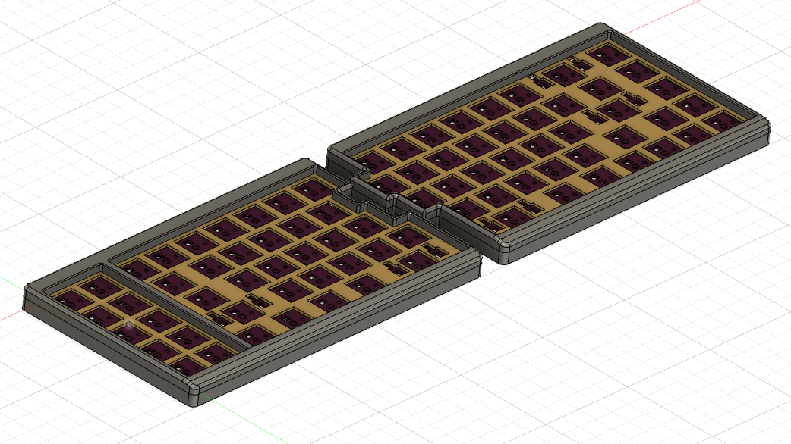
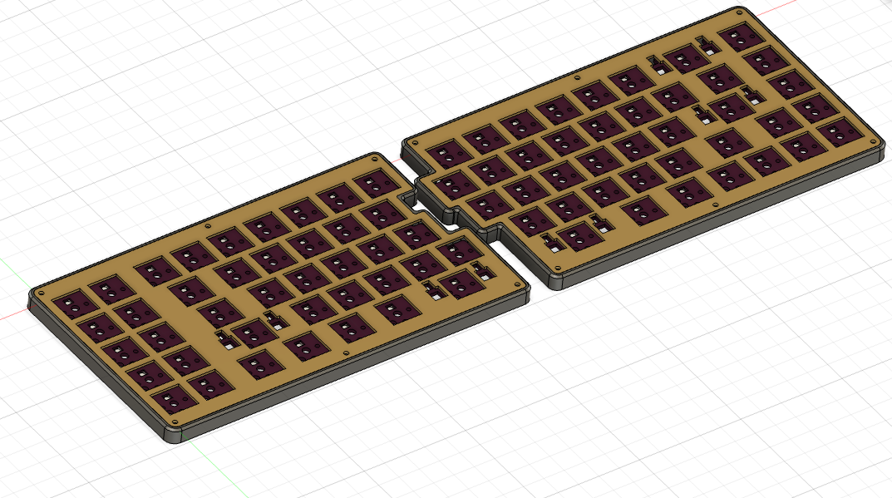

# Cepstrum Keyboard Case

## 3D-Print Files

There are two different sets of 3D-printed parts available.

### Enclosed Case

One is a two-piece print for each half that consists of a top shell that goes over the switch plate, and a middle layer that goes between the switch plate and bottom plate. The files for this can be found in the [`enclosed`](enclosed) directory.

The top shell has an angled front lip that can be hard to print well using an FDM printer, so the top shell pieces are better done using a resin printer.

You will need M2 8mm screws to insert through the bottom plate up to the top shell.

### Mid-Only Case

The other option is just a middle layer. The switch plate will slot into this middle layer. You can just use the 6mm standoffs and 4mm screws that come with the Cepstrum plate kit with this piece. The files for this can be found in the [`mid-only`](mid-only) directory.

## Plate Files

Plate files are in the [`plates`](plates) directory. They are designed to be 1.2mm thick.

## License

These case files are released under the MIT License.
